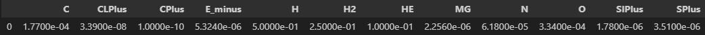
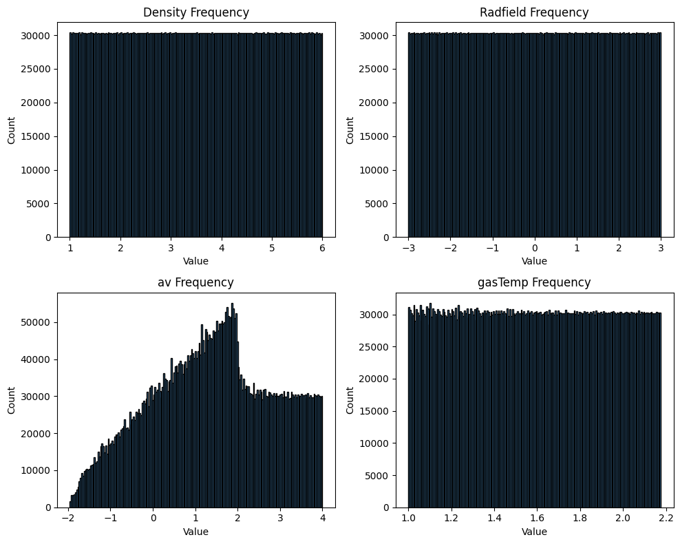

### Training/Validation Dataset
I sampled both datasets separately since I used Latin Hypercube Sampling. The datasets use the following initial abundances and physical parameter ranges.

All abundances are normalized to H nuclei abundance.

These physical parameters are sampled in log space.
| Parameter  | Range (Min, Max) | Units | Notes |
|------------|----------------|--------|------------------------------------------------------------|
| **Density**  | (1e1, 1e6)    | H nuclei per cm³ | Limits arbitrarily chosen. |
| **Radfield** | (1e-3, 1e3)   | Habing field | Limits arbitrarily chosen. |
| **Av**       | (1e-2, 1e4)   | Magnitudes | Limits arbitrarily chosen. |
| **GasTemp**  | (10, 150)     | Kelvin | Grain reactions are too complex below 10K. Ice mostly sublimates at 150K, and UCLChem sets this as a strict constraint. |

The following link holds the dataset in zip format on google drive. Inside are included two separate hdf5 files, one named uclchem_rawdata_training.h5 and the other uclchem_rawdata_validation.h5. The first holds 60k models and the second holds 20k models.
[Click Here to Download Dataset](https://drive.google.com/file/d/1PNDP17800zpXQSr70EuzCMdfhte9GtaV/view?usp=sharing)

### Gas-Grain Chemical Network Surrogate

In order to use this surrogate model, refer to the Examples folder which contains notebooks showcasing how to use the models and generate plots.

The dataset for this surrogate model was generated using UCLChem. A dataset generation script is included in this repository to replicate results.

60k models were created for training and 20k for validation. The initial abundances are constant for all models, and only the physical parameters are varied. The physical parameters were sampled using latin hypercube sampling in log-space. The only physical parameter kept constant is the Cosmic Ray Ionization Rate, which is kept at 3.0261e-17 ionizations per second. 

With 100 timesteps per model, the total dataset size is 8,000,000 rows of data. Since the model is trained to predict 1-100 timesteps, we can train using all combinations of pairs of abundances. For example (0, 1), (0, 2), (0, 3), (1, 2), (1, 3), (2, 3), ... etc

The validation loss for the results are defined as

loss = abs(actual - predicted) / actual

This loss is calculated for each species and then the mean is calculated. This is calculated for the entire validation set. The species abundances range from 1e-20 to 1.
